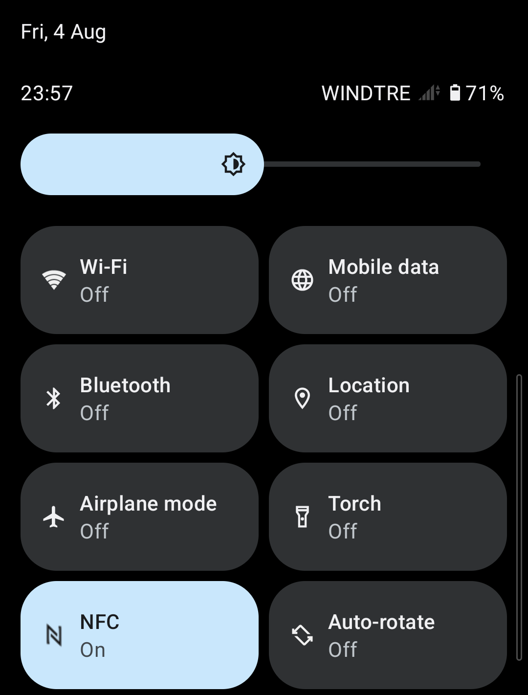

# NFC Tile


Add a tile to Android Quick Settings that can be pressed to toggle the NFC state.



## Download

Get the app on the [latest release page](https://github.com/docheinstein/nfc-tile/releases/latest).

## Setup

In order to change the NFC state, this app needs a special permission that can be granted with ADB with the following command.

```
adb shell pm grant org.docheinstein.nfctile android.permission.WRITE_SECURE_SETTINGS
```

